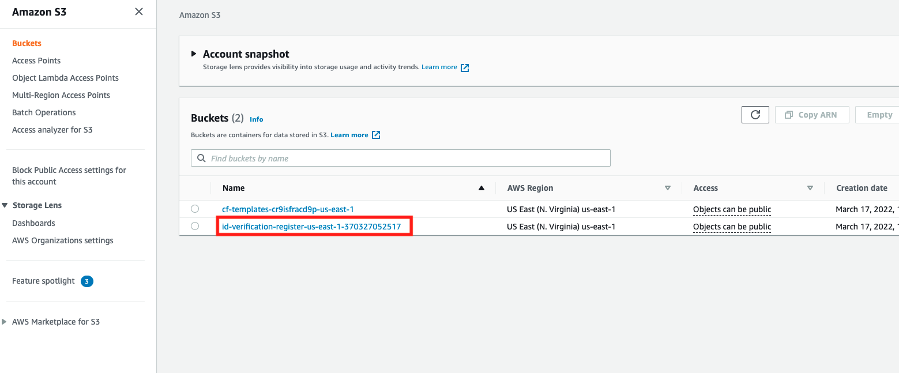
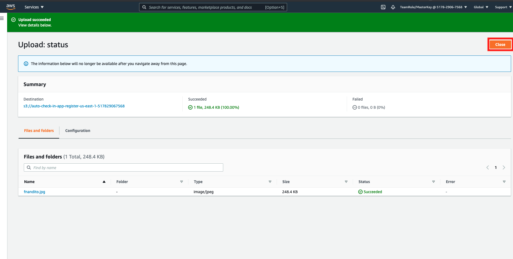
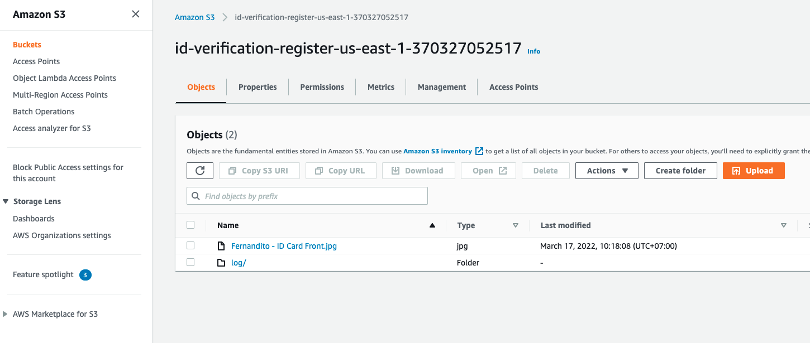

## Upload Registration Image to Amazon S3

1. Open [AWS S3 Console](https://s3.console.aws.amazon.com/s3/home?region=us-east-1#)
2. click the bucket named `id-verification-register...`
    
3. In bucket page, click `Upload`
4. to upload page, you can drag and drop the image, or you can also click `Add files` to upload image. Make sure it's on `.jpg` format
5. once the image is uploaded, click `Upload`
    
6. once uploaded, click `close`
    
7. if the upload is correct, you can see the S3 bucket page just like this example below.
    

[BACK TO WORKSHOP GUIDE :house:](../../README.md)

[CONTINUE TO NEXT GUIDE :arrow_right:](ConfigureApp.md)

[BACK TO PREVIOUS GUIDE :arrow_left:](CloudFormationStack.md)